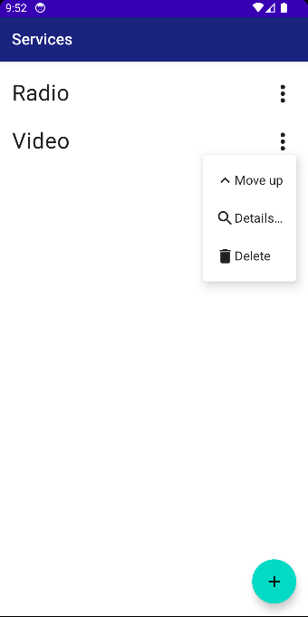
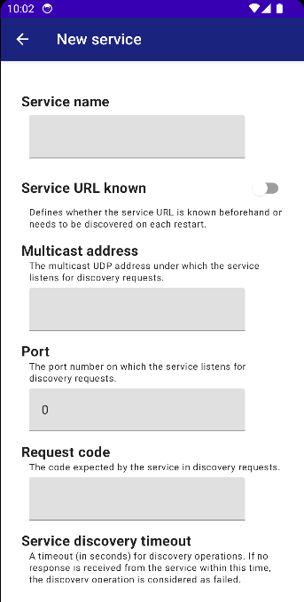
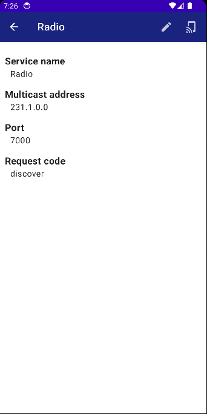

:toc:
:toc-placement!:
:toclevels: 3
= Wi-Fi Control

_Wi-Fi Control_ is an Android app that allows controlling services in the local network via the smartphone.

toc::[]

== Synopsis
Wi-Fi Control targets hobbyists and SmartHome enthusiasts who run services (such as IoT applications or media servers) in their home network. A _service_ in this context is an application running on a computer reachable via the Wi-Fi. For interaction, the application exposes a control UI on a defined URL. Wi-Fi Control can be used to manage such services by creating corresponding service definitions in the app. It then accesses the services via their URLs and opens their control UIs in a Web view control. That way, users can interact with these services via their smartphone; it is not necessary that the computers running the services are connected to input or output devices like a keyboard or a monitor.

The URL of a service can either be fix; in this case it can be hard-coded in the service definition. Alternatively, an auto-discovery mechanism is available. Wi-Fi Control then tries to discover the service URL automatically using a proprietary protocol based on https://en.wikipedia.org/wiki/User_Datagram_Protocol[UDP] requests. This is especially useful if https://en.wikipedia.org/wiki/Dynamic_Host_Configuration_Protocol[DHCP] is used, and IP addresses or URLs can change dynamically.

The original use case for this app was an audio player application running on a https://www.raspberrypi.com/[Raspberry Pi]. The tiny computer should be placed somewhere in the background where no space was available for a screen or a keyboard. So, how could users interact with the player software? The solution was to expose the player functionality via a Web UI which could be used from a smartphone.

Since there are many possible scenarios with similar requirements, Wi-Fi Control has been developed to handle them in a generic way.

== Use Cases
This section gives an introduction about the different use cases supported by the Wi-Fi Control app.

[#use_case_listing_services]
=== Listing Services
When starting the app, by default, it displays the list of services as shown in figure <<fig_services_overview>>.

[#fig_services_overview]
.Services overview screen

The screen shows all the services that have been created in the app so far, together with a menu providing commands to interact with them. Initially, the list of services is empty. New services can be created by clicking on the `+` icon.

For each service, in the associated menu, some commands are available. It is possible to

* View details of the service.
* Delete the service.
* Change the service's position in the list. This is useful, since there is functionality to iterate through the control UIs of the single services. This happens in the order of the services in this list.

Clicking on the name of a service opens its control UI.

[#use_case_creating_service]
=== Creating a new Service
Clicking on the `+` icon on the <<use_case_listing_services>> screen opens a form that allows creating a new service. Figure <<fig_services_new>> shows how this form looks like.

[#fig_services_new]
.Create a new service

Each service must have a unique name; this name is displayed in the <<use_case_listing_services>> screen. It has to be entered in the first input field of this form.

The remaining input fields determine how the control UI of this service needs to be accessed. There are two options:

* If the service URL is fix, the `Service URL known` checkbox should be enabled. It is then possible to enter the URL directly in a corresponding field.
* If the service URL needs to be discovered dynamically, the user has to enter the parameters of the discovery operation. These are the following (refer to the documentation of the discovery protocol for further details):
** `Multicast address` defines the UDP multicast address of the service's discovery endpoint.
** `Port` is the port number on which the service's discovery endpoint is listening.
** `Request code` specifies a code expected by the service; only if the correct code is provided, the service will answer the request.
** In addition to these basic properties for a discovery operation, some advanced settings can be provided for a timeout and the frequency in which discovery requests are sent to the service. For those, the app uses typical default values which only have to be overridden in special cases.

[#use_case_service_details]
=== Viewing Service Details
With the `Details` menu item from the services overview screen, a form showing all the properties of this service can be displayed, as can be seen in figure <<fig_services_details>>.

[#fig_services_details]
.Service details

The major part of this screen just displays data and does not support further interactions. However, with icons in the top bar, the <<use_case_edit_service,edit form>> and the <<use_case_control_ui,control UI>> for the current service can be opened.

[#use_case_edit_service]
=== Editing a Service
From the <<use_case_service_details,Service Details>> screen, it is possible to edit the properties of the service by clicking on the pencil icon. This opens a form analogously to the one for <<use_case_creating_service>>. Here, the single properties of the service can be manipulated.

Note that input validation is performed. Fields containing invalid data are marked accordingly and prevent the form from being saved.

[#use_case_control_ui]
=== Opening the Service's Control UI
Interaction with a service is done via its control UI that is loaded from the service's URL and displayed in a Web view control. If the URL is fix for the service, it is opened directly. Otherwise, a discovery operation is started. Here, the app repeatedly sends requests to the service's discovery endpoint according to the parameters specified in the service definition. On receiving a response from the service that includes the URL, the app can show the control UI. If this does not happen within the configured timeout, it displays an error message instead. The result of a successful discovery operation is cached while the app is running; so it is directly available when opening the control UI for a second time.

IMPORTANT: Wi-Fi Control expects that the service is accessed via the Wi-Fi. So, opening a service's control UI is only possible if the phone is connected to a Wi-Fi. If this is not the case, the app only displays a corresponding error message.

Opening the control UI is possible from the <<use_case_listing_services>> screen by clicking on the service name. Alternatively, there is an icon in the top bar of the <<use_case_service_details>> screen that has the exact same effect.

The control UI is completely in the responsibility of the service; Wi-Fi Control just opens it. Hence, the possible interactions are highly specific to concrete services. The only elements in the UI contributed by the app are the top bar showing the service name, and a field with the URL that is used in the footer. The top bar also contains small navigation icons that can be used to switch to the control UIs of the previous and the next service in the list of managed services. These are only visible if there actually is a previous or next service.

=== Deleting a Service
Obsolete services can be deleted using the service menu in the <<use_case_listing_services>> screen. Before that, the operation must be confirmed.

== License
Wi-Fi Control is available under the http://www.apache.org/licenses/LICENSE-2.0.html[Apache 2.0 License].